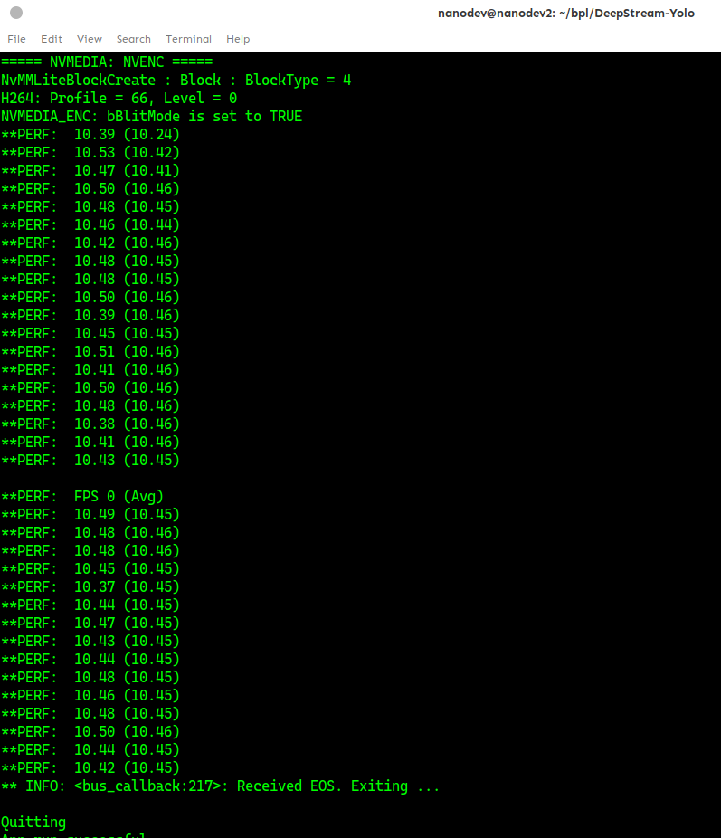
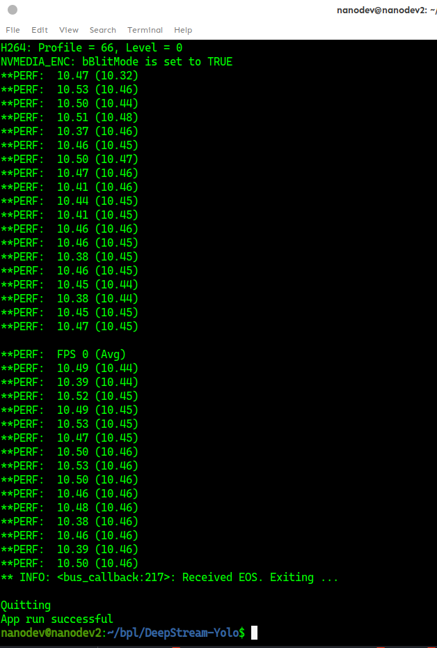

# EMLO Session 10

The goal of the assignment is to run YOLOv7 and YOLOV7-Tiny on Jetson Nano.

To generate the weights, run the following commands
(This was run on a g4dn.2xlarge spot instance)

```bash
git clone https://github.com/WongKinYiu/yolov7.git
git clone https://github.com/marcoslucianops/DeepStream-Yolo
cp DeepStream-Yolo/utils/gen_wts_yoloV7.py yolov7/
cd yolov7
pip install -r requirements.txt
wget https://github.com/WongKinYiu/yolov7/releases/download/v0.1/yolov7.pt
python3 gen_wts_yoloV7.py -w yolov7.pt
```

Repeat with yolov7-tiny.

**Videos:**
- [Original Video](https://www.youtube.com/watch?v=Y2zwg6E6T5M)
- [Output - yolov7-tiny](https://www.youtube.com/watch?v=n4h35IbbJuM)
- [Output - yolov7](https://www.youtube.com/watch?v=XBEj3PDEw1A)

For yolov7-tiny version



For yolov7 version



Not much difference in the FPS was observed!